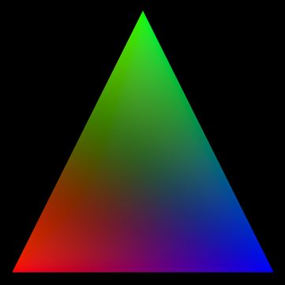

# Hello Triangle for Swift

Apple's introductory tutorial for Metal, [Hello Triangle](https://developer.apple.com/documentation/metal/hello_triangle), ported to Swift 4.0 for your enjoyment. 

_Updates from the original demo include support for rotation and the option to support wide color (P3) pixel format._

[You can read more about this demo here.](https://medium.com/@heypete/hello-triangle-meet-swift-and-wide-color-6f9e246616d9)

